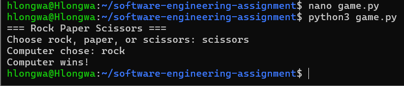

# Rock Paper Scissors Game

## Project Description
This is a simple Rock Paper Scissors game developed in Python for the Software Engineering assignment.

The game allows the player to play against the computer using terminal input.

## Features
- User input handling
- Random computer choices
- Win/Lose/Tie logic
- Command-line gameplay

## Requirements
- Python 3 installed

## How to Run

Run the following command:

```bash
python3 game.py
```

## Example

Player chooses:
- rock
- paper
- scissors

The computer randomly selects a choice and displays the result.

## Screenshot



## Author
Akhona Hlongwa


# Assignment 8: Object State Modeling and Activity Workflow Modeling

## State Transition Diagrams

### Completed State Diagrams
- Book State Diagram
- User Account State Diagram
- Loan State Diagram
- Reservation State Diagram
- Fine Payment State Diagram
- Membership State Diagram
- Notification State Diagram
- Librarian Session State Diagram

Location:
```text
diagrams/state-diagrams/
```

---

## Activity Workflow Diagrams

### Completed Activity Diagrams
- Checkout Book Workflow
- User Registration Workflow
- Return Book Workflow
- Reserve Book Workflow
- Pay Fine Workflow
- Renew Membership Workflow
- Login Process Workflow
- Generate Report Workflow
- Cancel Reservation Workflow

Location:
```text
diagrams/activity-diagrams/
```

---

## Reflection

Reflection document located at:

```text
docs/library_reflection.md
```

---

## Technologies Used

- GitHub
- Mermaid UML Diagrams
- Markdown Documentation
- Git Version Control

---

## Repository Structure

```text
project/
│
├── diagrams/
│   ├── state-diagrams/
│   └── activity-diagrams/
│
├── docs/
│   └── library_reflection.md
│
└── README.md
```
