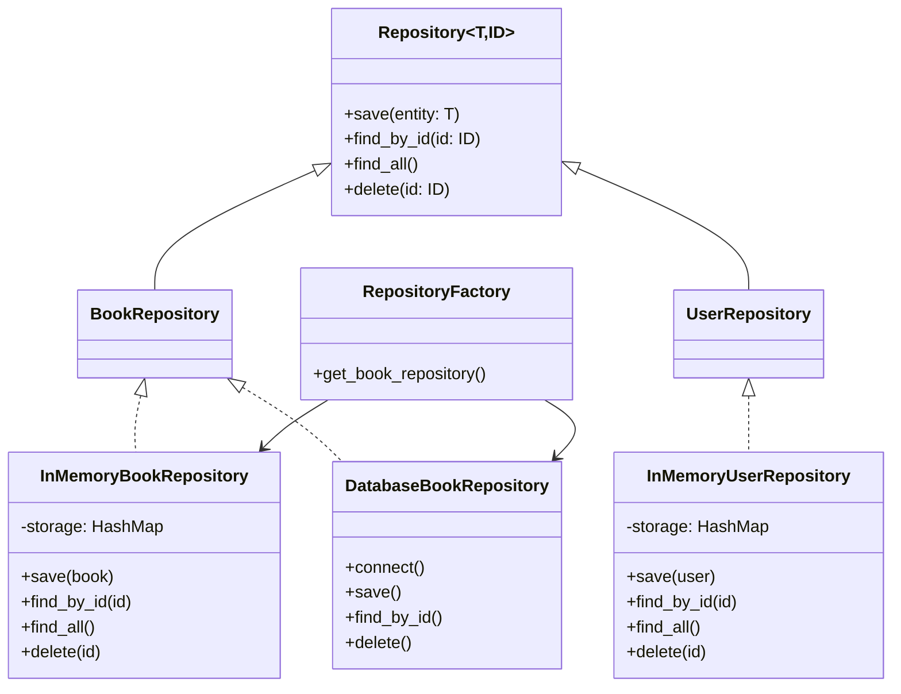

# Assignment 11 Repository Class Diagram

```mermaid
classDiagram

class Repository~T,ID~ {
    +save(entity: T)
    +find_by_id(id: ID)
    +find_all()
    +delete(id: ID)
}

class BookRepository
class UserRepository

Repository <|-- BookRepository
Repository <|-- UserRepository

class InMemoryBookRepository {
    -storage: HashMap
    +save(book)
    +find_by_id(id)
    +find_all()
    +delete(id)
}

class InMemoryUserRepository {
    -storage: HashMap
    +save(user)
    +find_by_id(id)
    +find_all()
    +delete(id)
}

BookRepository <|.. InMemoryBookRepository
UserRepository <|.. InMemoryUserRepository

class DatabaseBookRepository {
    +connect()
    +save()
    +find_by_id()
    +delete()
}

BookRepository <|.. DatabaseBookRepository

class RepositoryFactory {
    +get_book_repository()
}

RepositoryFactory --> InMemoryBookRepository
RepositoryFactory --> DatabaseBookRepository
```
