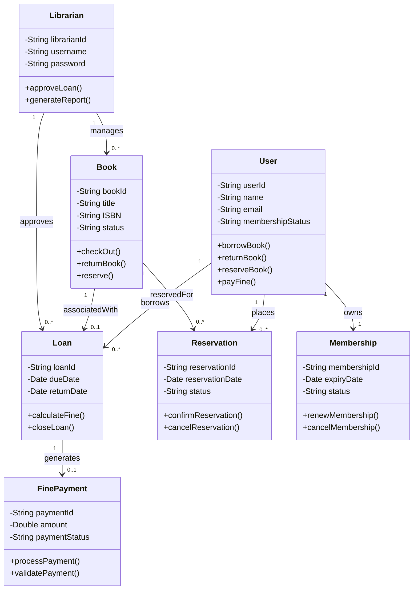

# Library Management System Class Diagram

# Explanation of Design Decisions

## Core Design

The class diagram models the core business entities of the Library Management System developed in previous assignments.

## Relationships

- A User may borrow many Loans.
- A Book may only be linked to one active Loan at a time.
- Users can place multiple Reservations.
- Membership is directly associated with a User.
- Loans may generate Fine Payments.

## Object-Oriented Principles

The design follows object-oriented principles by:
- Encapsulating attributes and methods within classes.
- Separating responsibilities across entities.
- Using associations to model real-world interactions.

## Multiplicity

Multiplicity was added to show:
- One-to-many relationships.
- Optional relationships.
- Ownership between objects.
