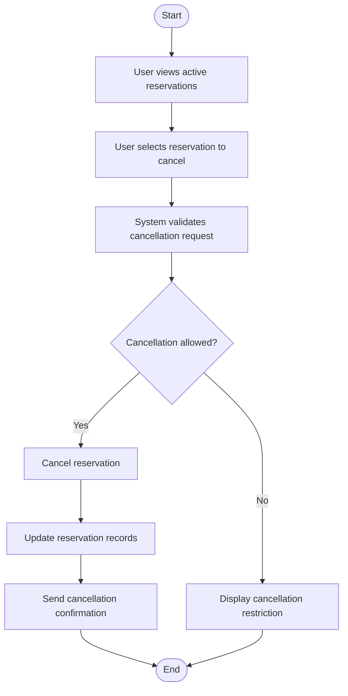

# Cancel Reservation Activity Diagram

# Explanation

## Workflow Summary

This workflow models the cancellation of book reservations.

## Key Actions

- Users select active reservations.
- System validates cancellation eligibility.
- Reservation records are updated automatically.

## Decisions

- System checks whether cancellation is permitted.

## Stakeholder Concerns

- Validation prevents invalid cancellations.
- Automatic updates improve consistency.
- Notifications improve user communication.
