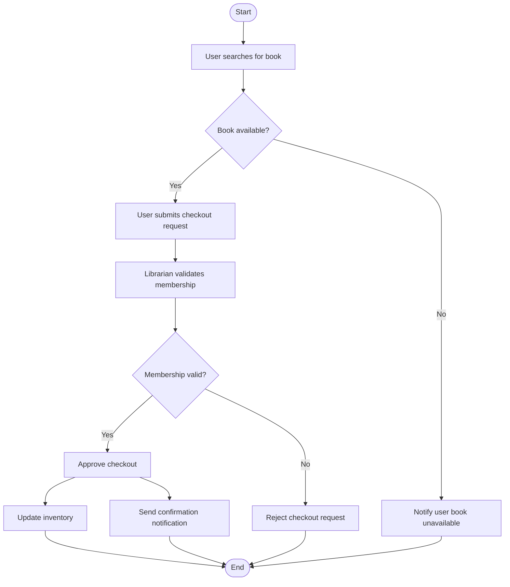

# Checkout Book Activity Diagram

# Explanation

## Workflow Summary

This workflow models the process of borrowing a book from the library system.

## Key Actions

- Users search for books.
- Librarians validate memberships.
- Inventory updates after approval.
- Notifications are sent automatically.

## Decisions

- The system checks whether the book is available.
- Membership validity determines approval.

## Parallel Actions

- Inventory update and notification sending happen simultaneously.

## Stakeholder Concerns

- Real-time inventory updates improve scalability.
- Membership validation improves security.
- Notifications improve communication with users.
