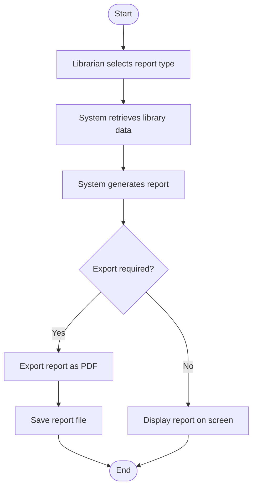

# Generate Report Activity Diagram

# Explanation

## Workflow Summary

This workflow models report generation in the library management system.

## Key Actions

- Librarians choose report types.
- System retrieves and processes data.
- Reports may be exported or displayed directly.

## Decisions

- System checks whether export is requested.

## Stakeholder Concerns

- Reporting improves management oversight.
- Export functionality improves usability.
- Automated reporting improves efficiency.
