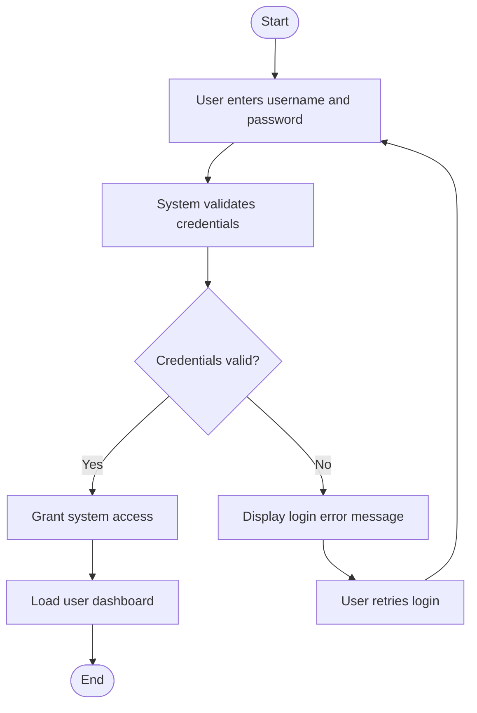

# Login Process Activity Diagram

# Explanation

## Workflow Summary

This workflow models how users authenticate into the library management system.

## Key Actions

- Users enter authentication credentials.
- System validates login information.
- Successful logins load user dashboard.

## Decisions

- The system checks whether credentials are valid.

## Stakeholder Concerns

- Authentication improves system security.
- Error handling improves usability.
- Dashboard loading improves user experience.
