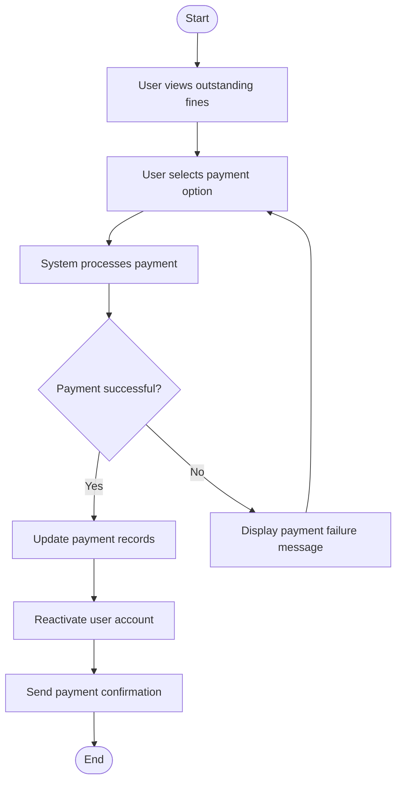

# Pay Fine Activity Diagram

# Explanation

## Workflow Summary

This workflow models how users pay overdue library fines.

## Key Actions

- Users select payment methods.
- System processes fine payments.
- User accounts are reactivated automatically.
- Payment confirmations are sent to users.

## Decisions

- The system checks whether payment was successful.

## Stakeholder Concerns

- Automatic payment validation improves efficiency.
- Account reactivation improves user experience.
- Notifications improve communication and transparency.
