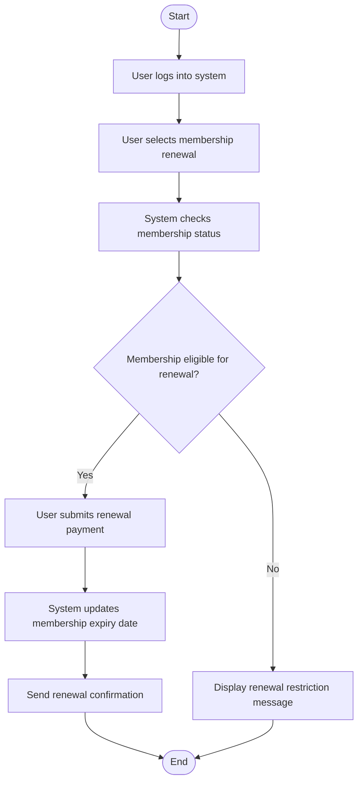

# Renew Membership Activity Diagram

# Explanation

## Workflow Summary

This workflow models how users renew library memberships.

## Key Actions

- Users request membership renewal.
- System validates renewal eligibility.
- Membership records are updated automatically.
- Confirmation notifications are sent to users.

## Decisions

- The system checks whether membership qualifies for renewal.

## Stakeholder Concerns

- Automated renewal improves efficiency.
- Eligibility validation improves security.
- Notifications improve communication with users.
