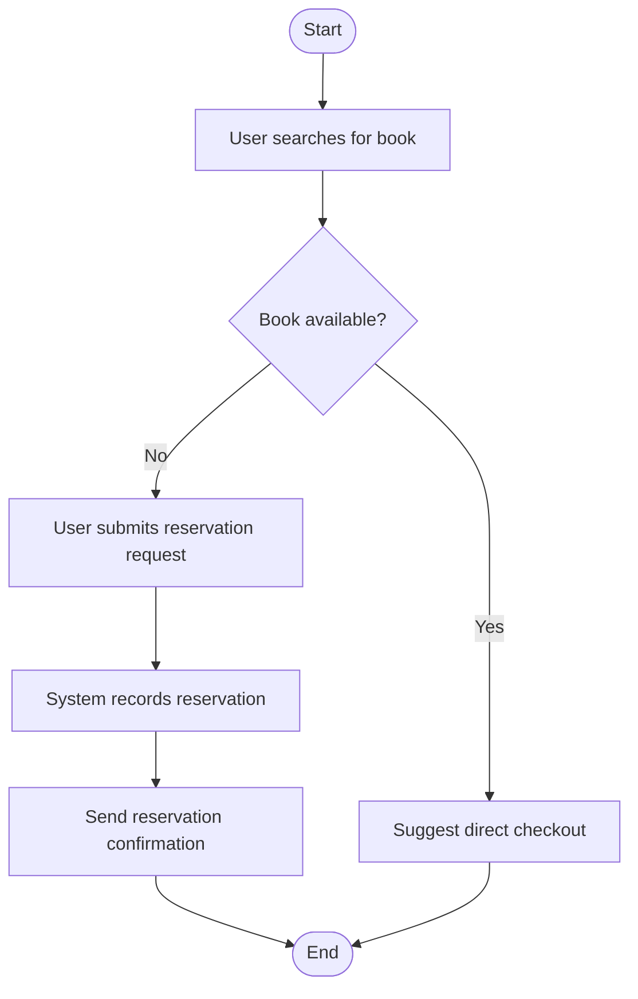

# Reserve Book Activity Diagram

# Explanation

## Workflow Summary

This workflow models the process of reserving unavailable books.

## Key Actions

- Users search for books.
- Reservation requests are recorded automatically.
- Confirmation notifications are sent to users.

## Decisions

- The system checks whether the book is already available.

## Stakeholder Concerns

- Reservation tracking improves user experience.
- Automatic notifications improve communication.
- Direct checkout suggestions improve efficiency.
