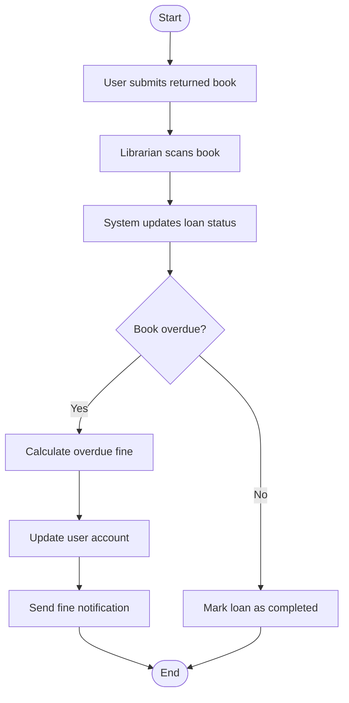

# Return Book Activity Diagram

# Explanation

## Workflow Summary

This workflow models the process of returning a borrowed book to the library.

## Key Actions

- Librarian scans returned book.
- System updates loan records.
- Overdue fines are calculated automatically.
- Users receive notifications if fines exist.

## Decisions

- The system checks whether the book is overdue.

## Stakeholder Concerns

- Automatic fine calculation improves efficiency.
- Real-time loan updates improve inventory tracking.
- Notifications improve communication with users.
