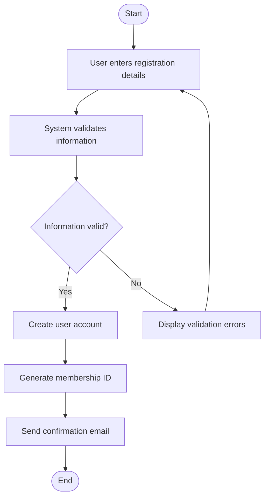

# User Registration Activity Diagram

# Explanation

## Workflow Summary

This workflow models how a new user registers in the library management system.

## Key Actions

- Users provide registration details.
- System validates submitted information.
- Membership ID is generated automatically.
- Confirmation email is sent after successful registration.

## Decisions

- The system checks whether entered information is valid.

## Stakeholder Concerns

- Validation improves data accuracy.
- Automatic membership creation improves efficiency.
- Confirmation emails improve communication with users.
