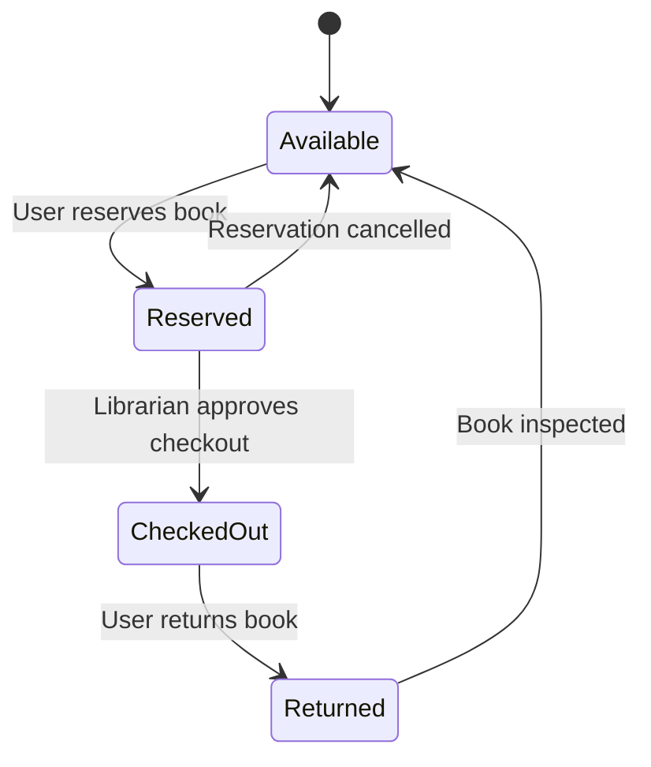

# Book State Transition Diagram

# Explanation

## Key States

- Available: Book is ready for borrowing.
- Reserved: Book is reserved by a user.
- CheckedOut: Book has been borrowed.
- Returned: Book has been returned to library.

## Functional Requirement Mapping

- FR-001: Users can reserve books.
- FR-002: Librarians approve book checkout.
- FR-003: Users can return books.
