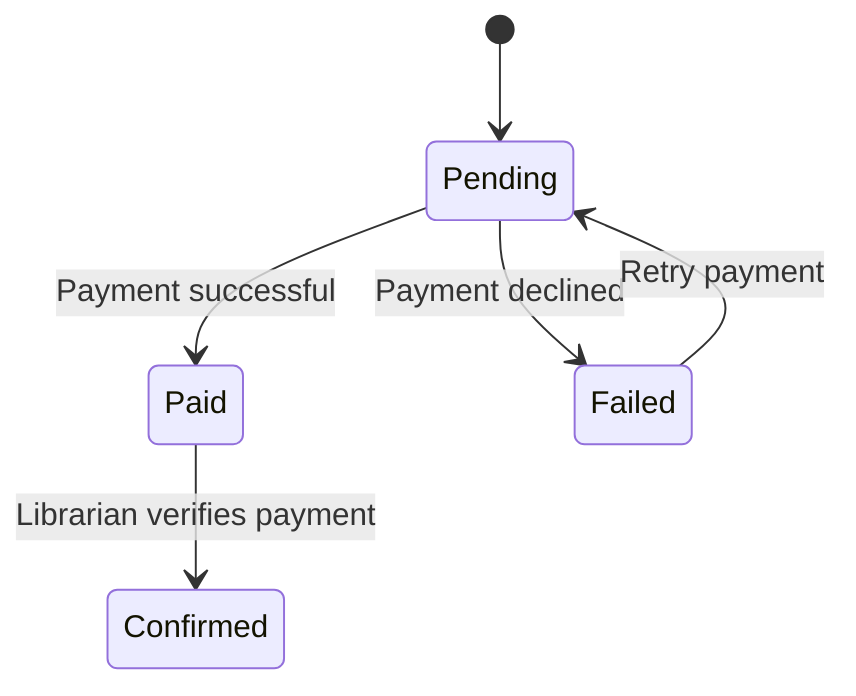

# Fine Payment State Transition Diagram

# Explanation

## Key States

- Pending: Fine awaiting payment.
- Paid: User completed payment successfully.
- Failed: Payment attempt unsuccessful.
- Confirmed: Payment verified by librarian.

## Key Transitions

- Payments move to paid after successful processing.
- Failed payments can be retried.
- Librarians confirm valid payments.

## Functional Requirement Mapping

- FR-013: Users can pay library fines.
- FR-014: System validates payment status.
- FR-015: Failed payments may be retried.
