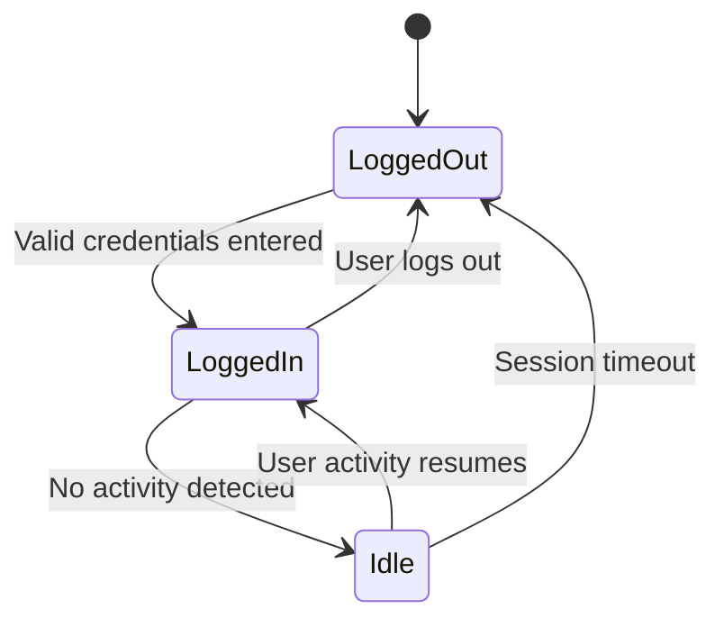

# Librarian Session State Transition Diagram

# Explanation

## Key States

- LoggedOut: Librarian not authenticated.
- LoggedIn: Librarian actively using system.
- Idle: Session inactive temporarily.

## Key Transitions

- Successful login starts session.
- Inactive sessions become idle.
- Sessions end after logout or timeout.

## Functional Requirement Mapping

- FR-021: Librarians authenticate securely.
- FR-022: Sessions timeout after inactivity.
