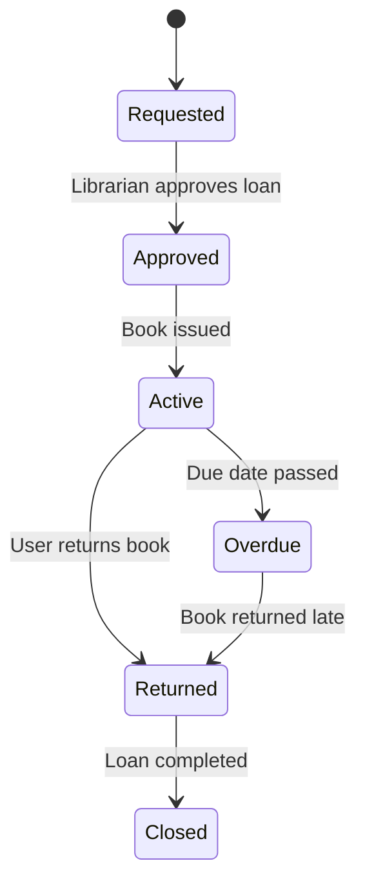

# Loan State Transition Diagram

# Explanation

## Key States

- Requested: User has requested a loan.
- Approved: Loan approved by librarian.
- Active: Book currently borrowed.
- Overdue: Return deadline missed.
- Returned: Book returned by user.
- Closed: Loan process completed.

## Key Transitions

- Loans are approved by librarians.
- Loans become overdue if the return date passes.
- Returned books close the loan process.

## Functional Requirement Mapping

- FR-007: Users can request book loans.
- FR-008: System tracks overdue books.
- FR-009: Users return borrowed books.
