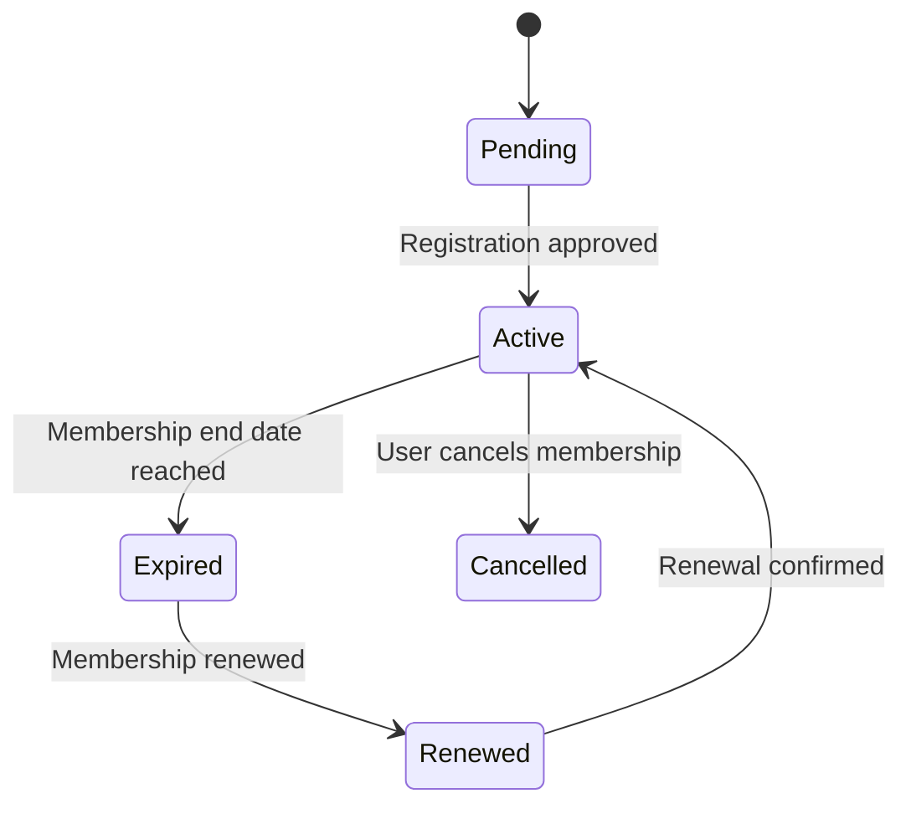

# Membership State Transition Diagram

# Explanation

## Key States

- Pending: Membership registration submitted.
- Active: User has active membership.
- Expired: Membership validity ended.
- Renewed: Membership renewal processed.
- Cancelled: Membership terminated.

## Key Transitions

- Membership becomes active after approval.
- Expired memberships may be renewed.
- Users may cancel active memberships.

## Functional Requirement Mapping

- FR-016: Users register for membership.
- FR-017: Users renew memberships.
- FR-018: Users cancel memberships.
