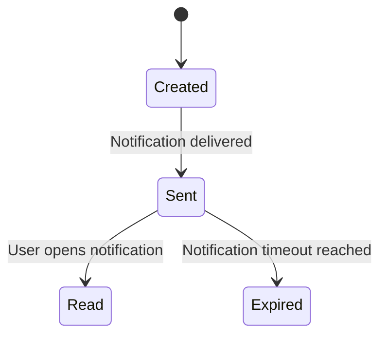

# Notification State Transition Diagram

# Explanation

## Key States

- Created: Notification generated by system.
- Sent: Notification delivered to user.
- Read: User viewed notification.
- Expired: Notification expired without being read.

## Key Transitions

- Notifications are sent automatically.
- Notifications become read when opened.
- Unread notifications eventually expire.

## Functional Requirement Mapping

- FR-019: Notify users about reservations and overdue books.
- FR-020: Track notification delivery status.
