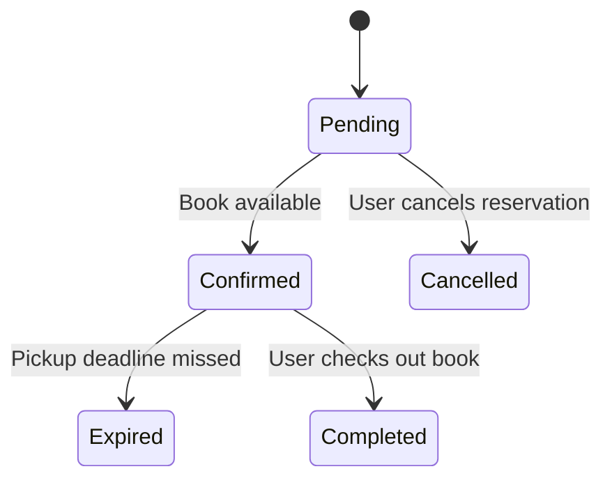

# Reservation State Transition Diagram

# Explanation

## Key States

- Pending: Reservation request submitted.
- Confirmed: Reservation approved and ready.
- Cancelled: Reservation cancelled by user.
- Expired: Reservation deadline passed.
- Completed: Reservation fulfilled successfully.

## Key Transitions

- Reservations are confirmed when books become available.
- Reservations expire if users fail to collect books.
- Users may cancel reservations before confirmation.

## Functional Requirement Mapping

- FR-010: Users can reserve unavailable books.
- FR-011: Users can cancel reservations.
- FR-012: System expires unclaimed reservations.
