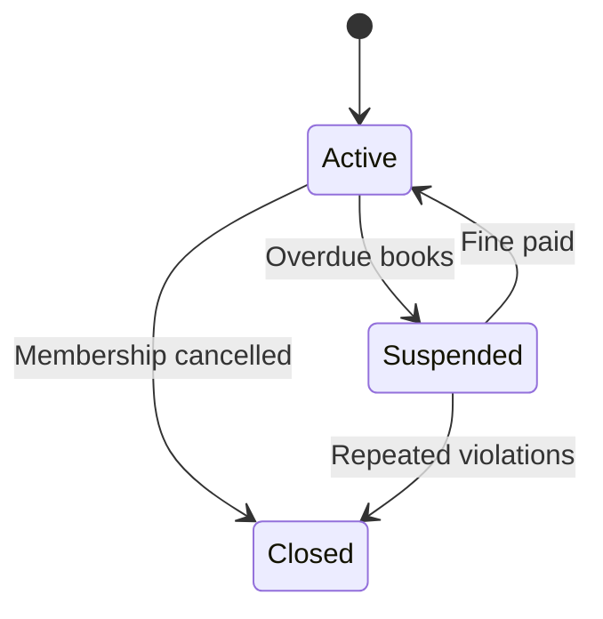

# User Account State Transition Diagram

# Explanation

## Key States

- Active: User account can borrow books.
- Suspended: Borrowing privileges temporarily disabled.
- Closed: Membership permanently terminated.

## Key Transitions

- Users become suspended when books are overdue.
- Suspended users can reactivate accounts after paying fines.
- Accounts may be closed if membership is cancelled.

## Functional Requirement Mapping

- FR-004: Suspend accounts with overdue books.
- FR-005: Reactivate accounts after fine payment.
- FR-006: Allow membership cancellation.
